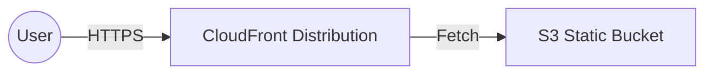
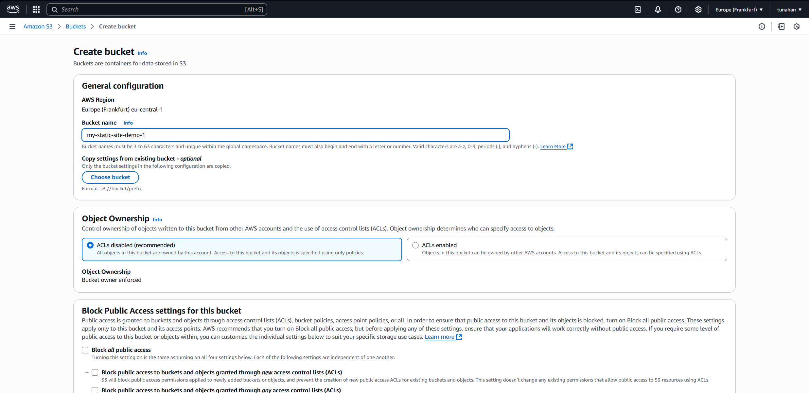
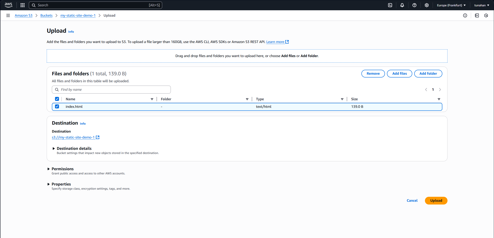
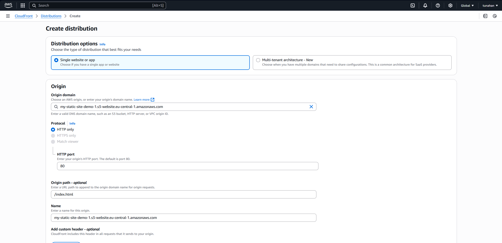
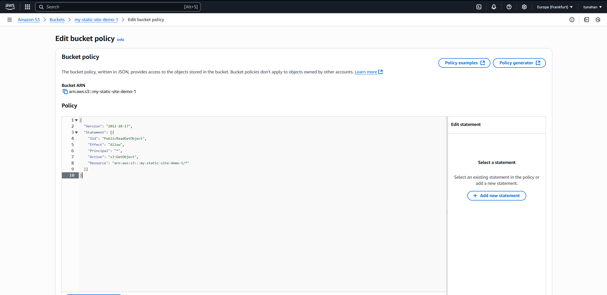
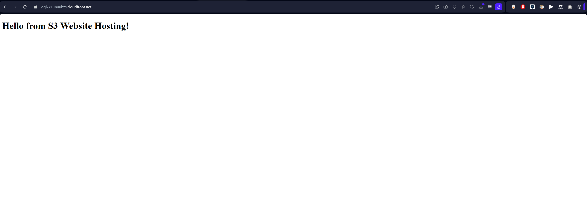

# Static Website Hosting (S3 + CloudFront)
> Global content delivery for static sites using Amazon's CDN.

## 🎯 Objective
Demonstrates the deployment of a high-performance static website hosted on S3 and distributed globally via Amazon CloudFront for low-latency access.

## 🚀 Key Features
- **Global Scalability:** Uses CloudFront edge locations for fast content delivery.
- **Secure Access:** Configures S3 bucket policies to allow access only via CloudFront (OAC/OAI).
- **Cost-Effective:** Serverless hosting with no management overhead.

## 🏗️ Architecture

## 🛠️ Tech Stack
- **Storage:** Amazon S3
- **CDN:** Amazon CloudFront
- **Security:** OAC (Origin Access Control)

---

## 🔧 Setup & Implementation

### 1. S3 Bucket Setup

Enable static website hosting.

### 2. Content Upload

### 3. CloudFront & Security
Configure the distribution and restrict bucket access.

## ✅ Verification
Access the site via the CloudFront domain.

---
Created by **Tunahan Koç** | [LinkedIn](https://www.linkedin.com/in/tunahan-koc-8b43b765/) | [GitHub](https://github.com/tnhkoc)
